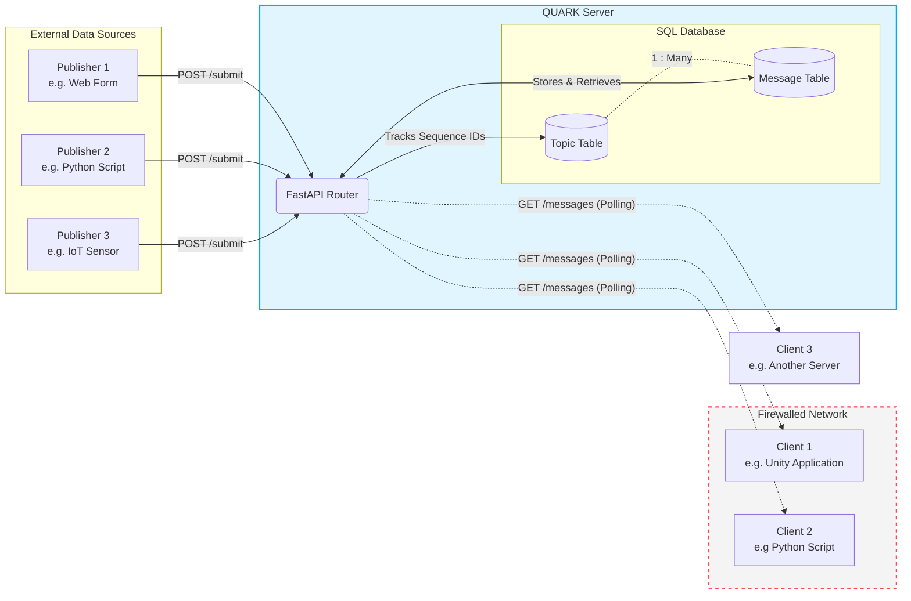
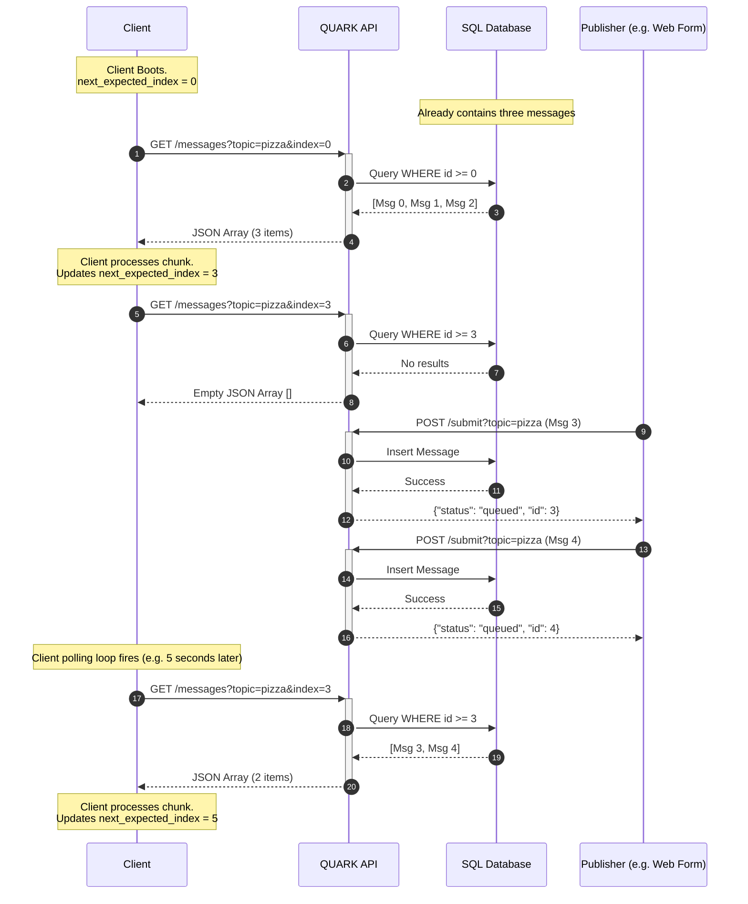

# QUARK: QUeued Asynchronous Request Keeper

[](https://github.com/azzeloof/quark/actions/workflows/lint.yml)
[](https://github.com/azzeloof/quark/actions/workflows/test.yml)
[](https://github.com/azzeloof/quark/actions/workflows/publish.yml)

## Problem
We want to have a web form that posts data to a server, but the server in question is on an arbitrary network that we don't own, and cannot forward ports through. 

## Solution
An intermediate API that accepts POST requests to ingest arbitrary data, which it stores in a database. A client can request all messages it hasn't seen with a GET request, optionally passing in a "cursor" or index of the last message it's seen. This acts as a "chunked queue" where incoming messages are stored in a queue that is retrieved in ordered chunks. This is useful for applications like Unity where the polling logic can be incorporated into a main loop, where threading is a pain, and when web sockets are infeasible due to firewalls. 


## Architecture
Dockerized python script that uses FastAPI, with a SQLite database (or the option to plug in a SQL database such as Postgres running in a different docker container, or a different server).




## How to use
Everything is packaged into a handy-dandy container (i barely know 'er!). Create a .env file with the following (depending on whether you want to use an external database such as postgres, or a local SQLite db file):
```
QUARK_API_KEY="secret_api_key"
# If you just want to use a local SQLite db, you can exclude the remaining lines. If you're connecting to an existing remote db, keep the URL line below and edit accordingly, but you can get rid of the POSTGRES_USER, POSTGRES_PASSWORD, and POSTGRES_DB lines.
QUARK_DB_URL="postgresql://myuser:mysecretpassword@db:5432/quarkdb"
POSTGRES_USER="myuser"
POSTGRES_PASSWORD="mysecretpassword"
POSTGRES_DB="quarkdb"
```
If you're using a SQLite db, make sure the postgres lines in the docker-compose.yml are commented out. Similarly, there's no need to mount a data volume for the Quark service if you're using a separate db. 
Then run `docker-compose up -d` 
Once it's running, documentation can be found at `http://<ip or domain>:8000/docs`, but in summary:

- To write a new message to the 'pizza' topic:
```
  curl -X POST "http://127.0.0.1:8000/submit?topic_name=pizza" \
     -H "Content-Type: application/json" \
     -H "X-API-Key: my_super_secret_key" \
     -d '{"message": "i like pasta", "color", "red", "number_of_meatballs": 6}'
```
You can also optionally include a `max_index` if you only want to grab a specific number of messages in a chunk. If no topic is included, it is assumed to be `default`. If a topic does not yet exist, it is created.

- To read messages in the 'pizza' topic after message '3':
```
  curl -X GET "http://127.0.0.1:8000/messages?topic=pizza&index=3" \
     -H "X-API-Key: my_super_secret_key" 
```
- There is also a `/topics` endpoint that returns a list of available topics and the current index for each.

To actually receive data, just poll your chosen topic periodically. Each time you poll, keep track of the highest index, so the next time you poll you know how to set the index.
Here's a diagram that shows an example workflow with one publisher and one client:


